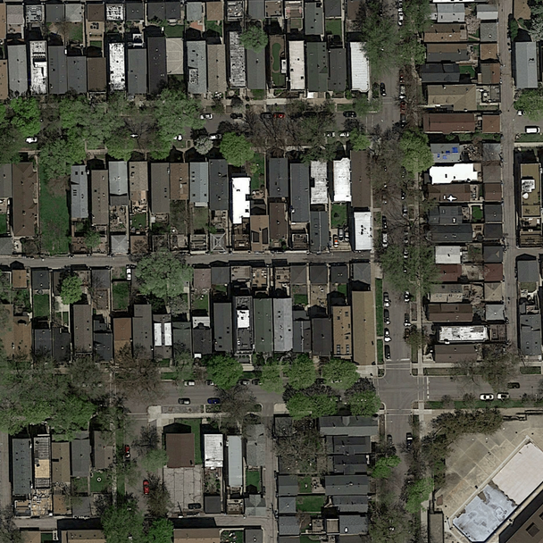

[](https://nodesource.com/products/nsolid)

# EPFL Machine Learning - Road Segmentation 2019

### About the Project
In this project, we implemented and trained using sattelite images, a residual
Unet for classifying pixels on an aerial image as either a road or
background.
Here is an example of our prediction on an aerial image:
|||

### Contributors
- Lucien Barret [@lubacien](https://github.com/lubacien)
- Dorian Popvic[@DorianPopovic](https://github.com/DorianPopovic)
- Théophile Bouiller[@tbouiller](https://github.com/tbouiller)
### Setup environment
The necessary can be installed using `pip` and the provided `requirements.txt`
```bash
   pip install -r requirements.txt
```
In order to run tf_aerial_images tensorflow must be downgraded. In order to get the correct version for tensorflow execute 
```bash
   pip install --upgrade tensorflow==1.13
```
### Run
The generate our best prediction submitted on aicrowd, execute:
```bash
   python3 run.py
```
from the root directory of the project.
The predictions are saved in the folder /submissionimages
